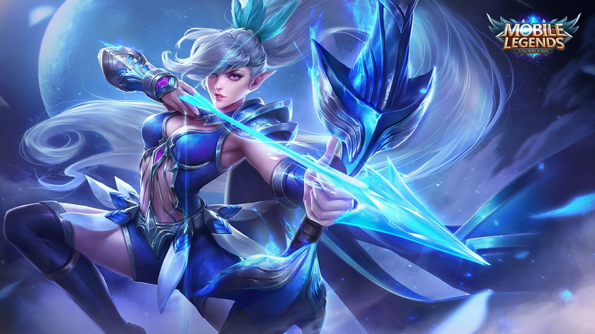

Hello, I am Arisson Roby Anak Ugil from BA2322A and I want to share to everyone about my life during the Movement Control Order (MCO). what did I do in the first week is, me and my roommate just playing a games either it Android games or window games. I will show to you guys the example picture of what games we had played for. At the first we were having fun but as a result when we playing often we get bored. During the MCO, our campus had been provided meal plans for the students who left in campus.

Come in the second week of MCO, I started to download lots of movies from the telegram group. I am expert in searching the High Definition and better quality movie. I think It just my luck that I found that group in telegram. I really enjoy watched the movies. In that time, I also downloaded some episode Anime. One of my favourite anime is Boruto. If you guys interested, I also share the link of the group.

 In the third week of MCO, the Online Distance Learning has started. For the first time I dont really prepare, but after that I think I can catch up with this learning methods. The only problem this I faced was internet connections is quite slow because I had spent it on downloaded the movies and the connections also slow when raining. I am very thankful to UITM and all of the college staff because they take a good care to all of we students who stayed in Campus.
 Below is the link where we can download the movies via telegram and the some pitcture of games that I have played.
 https://t.me/movies_cartoons_english
 
 
 
 
 
